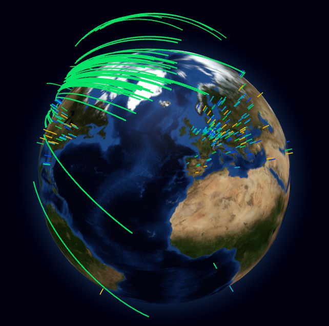

# Network Globe - Real-Time TCP Packet Sniffer for Network Location Visualization

See where your TCP packets are coming from/going to in Real-time!

This repository contains a Real-time TCP packet sniffer for network visualization. See the various locations where TCP packets are sent or received. The application parses IP addresses from packets, looks up their locations (lat and lng) using GeoLite2, and visualizes the packet data on a globe using Globe GL.



See a [demo](https://demo.storj.dev)

## Features

- Parses IP addresses from TCP packets using [pcap](https://pkg.go.dev/github.com/google/gopacket/pcap)
- Performs location lookup using [GeoLite2](https://dev.maxmind.com/geoip/geolite2-free-geolocation-data?lang=en)
- Visualizes locations on a globe with [Globe GL](https://globe.gl/)
- Demo file uploads with [Storj](https://storj.io?ref=network-globe)

## Installation

### Prerequisites

- libpcap (for packet capturing)
- GeoLite2-City.mmdb database from [MaxMind](https://dev.maxmind.com/geoip/geolite2-free-geolocation-data?lang=en)
  - Obtain the Free [GeoLite2-City.mmdb database](https://dev.maxmind.com/geoip/geolite2-free-geolocation-data?lang=en)
  - Extract and place the database file (`GeoLite2-City.mmdb`) in the project directory or specify path with `--geolite2-path` flag

### Install

#### Ubuntu

```bash
sudo apt install libpcap-dev
# TODO
```

#### macOS

```bash
# TODO
```

### Build

2. Install dependencies:

   ```bash
   go mod download
   ```

## Usage

1.  Give read permissions for pcap to read the network packets:

    ```bash
    sudo chmod +r /dev/bpf*
    ```

1.  Configure your network interface:

    ```bash
    # List available network devices
    ./network-globe --list-devices
    # Default device is en0
    ./network-globe --device en0
    ```

1.  Set the GeoLite2 database path:

    ```bash
    # Default path is GeoLite2-City.mmdb
    ./network-globe --geolite2-path GeoLite2-City.mmdb
    ```

1.  Start network-globe:

    ```bash
    ./network-globe
    ```

1.  Open the browser and navigate to <http://localhost:8000>

1.  (Optional) Set the source location (Latitude and Longitude) for the Globe visualization:

    The origin is configured to be in the United States. You can set the source location using the `--lat` and `--lng` flags.

    ```bash
    ./network-globe --lat 39.781932 --lng -104.970578
    ```

1.  (Optional) Demo uploads to Storj:

    - Sign up for a free trial account at [Storj](https://storj.io?ref=network-globe).
    - Obtain an [Access Grant](https://docs.storj.io/dcs/access#create-access-grant)
    - Set the `--access` and `--bucket` flags with the Access Grant and Bucket name.

    - Use the provided script or your preferred method to upload a file to Storj.

## Build

Clone the repository:

```bash
git clone https://github.com/amozoss/network-globe.git
cd network-globe
```

### linux

```bash
sudo apt install libpcap-dev gcc
CGO_ENABLED=1 go build
```

### macOS

```bash
go build
```

## Project Structure

- `public/index.html`: HTML file for the Globe GL visualization and websocket connection.
- `main.go`: packet sniffer written in Go using pcap library.
- `server.go`: Handles the packets, formats the message for the frontend, and broadcasts them to the client.

## Contributing

Contributions are welcome! Please submit a pull request or open an issue for any improvements or bug fixes.

## License

This project is licensed under the MIT License.

## Acknowledgements

- [Pcap tutorial](https://www.devdungeon.com/content/packet-capture-injection-and-analysis-gopacket)
- [MaxMind GeoLite2](https://dev.maxmind.com/geoip/geolite2-free-geolocation-data?lang=en)
- [Globe GL](https://github.com/vasturiano/globe.gl)
- [Storj](https://storj.io?ref=network-globe)
